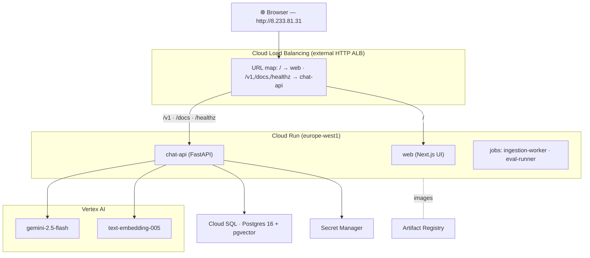

# Fluidra Pool Assistant

A **safety-first, Gemini-powered conversational assistant** for residential pool owners. It answers
equipment questions with **grounded, cited** information from official manuals — and a deterministic
safety gateway runs **before any LLM call**, so chemical-mixing questions are hard-blocked and
physical-risk questions escalate to a human.

> 🟢 **Live demo:** **http://8.233.81.31/**  ·  📘 **Blueprint:** [rendered](http://8.233.81.31/blueprint.html) / [`Fluidra_Implementation_Blueprint.md`](Fluidra_Implementation_Blueprint.md)  ·  📖 **Original requirement:** [requirements.html](http://8.233.81.31/requirements.html)

The full as-built documentation (live URLs, every Google Cloud resource with console links,
diagrams, navigation, config, deviations) is **Part 0** of the
[Implementation Blueprint](Fluidra_Implementation_Blueprint.md).

---

## What it does

A pool owner asks a question. The request is classified **deterministically before any model call**:

| Tier | Example | Behavior |
|------|---------|----------|
| **T1** informational | "my salt system shows code 125" | RAG → grounded, **cited** answer from the manual |
| **T2** dosing | "how much chlorine should I add" | structured **dosing card** from a deterministic calculator — never the LLM |
| **T3** physical risk | "there's a burning smell from my heater" | **stop-use + human escalation** |
| 🔒 chemical mixing | "can I mix acid and chlorine" | **hard-blocked** — never reaches the model |

## Architecture (as-built)



Inside `chat-api`: **safety classify → (T1) orchestrate**, where the orchestrator is an explicit
**LangGraph** `retrieve → generate → verify → fallback`: embed the query with Vertex
`text-embedding-005`, retrieve from **pgvector** with hybrid (dense + exact fault-code) search,
generate with **`gemini-2.5-flash`**, and gate on **groundedness ≥ 0.8** (else escalate rather than
hallucinate). Every turn is persisted (redacted) to Cloud SQL.

## Quickstart (local)

Prereqs: Python 3.12, [uv](https://docs.astral.sh/uv/), Node 20 + pnpm, Docker, GNU make (Git Bash/WSL on Windows).

```bash
make bootstrap          # uv sync + pnpm install + pull docker images + seed .env
make dev                # postgres+redis (pgvector), run migrations, start chat-api on :8080
curl localhost:8080/healthz          # → {"status":"ok","db":"ok",...}

# Ingest the manual corpus (offline, fake embeddings) and run the assistant offline:
uv run python -m ingestion_worker.corpus --store inmemory --backend fake

# Web UI against the deployed API:
NEXT_PUBLIC_API_BASE_URL=http://8.233.81.31 pnpm --filter web dev   # → http://localhost:3000
```

The whole stack runs **fully offline** with fake embeddings + a fake LLM (`EMBEDDING_BACKEND=fake`,
`LLM_BACKEND=fake`); real Vertex is used in the cloud.

## Testing & the safety gate

```bash
uv run pytest tests/safety services packages -q   # full suite
uv run python -m eval_runner --gate               # golden set + safety gate
pnpm --filter web test                            # web: components + a11y + api
```

Gates that block merge (CI: [`.github/workflows/ci.yml`](.github/workflows/ci.yml)):
**chemical-mixing block = 100%**, safety routing = 100%, golden-set pass ≥ 85%, groundedness ≥ 0.8.

## Repository structure

```
apps/web/                 Next.js chat UI (+ published docs in public/)
services/
  chat-api/               FastAPI entrypoint: /v1/chat, routing, persistence
  safety-gateway/         deterministic classifier (mixing block, T3, PII redaction)
  orchestrator/           LangGraph RAG + Gemini + citations + groundedness
  ingestion-worker/       parse → chunk → embed → index (pgvector / Vertex)
  dosing-service/         deterministic chemistry calculator
  eval-runner/            golden-set evals + gate
packages/
  shared-types · safety-policy · chemistry-tables · prompts · observability
infrastructure/
  docker/                 multi-stage images (python.Dockerfile, web.Dockerfile)
  terraform/              modules + envs/dev (the deployed dev environment)
documentation/
  onboarding/ · runbooks/ (deploy.md, observability.md)
Fluidra_Implementation_Blueprint.md   the design + as-built blueprint
```

## Deployment

All infrastructure is **Terraform** in [`infrastructure/terraform/envs/dev`](infrastructure/terraform/envs/dev)
(Cloud Run, Cloud SQL, Secret Manager, Artifact Registry, IAM, Workload Identity, Monitoring, an
external Load Balancer). It is deployed to a live dev project. See the
[deploy runbook](documentation/runbooks/deploy.md) and **Part 0** of the
[blueprint](Fluidra_Implementation_Blueprint.md) for live URLs, the full resource map with Google
Cloud console links, and step-by-step navigation.

```bash
# from a machine with gcloud + terraform, authenticated to the project:
terraform -chdir=infrastructure/terraform/envs/dev apply \
  -var="project_id=<PROJECT>" -var="enable_load_balancer=true"
```

## Tech stack

Python 3.12 · FastAPI · LangGraph · Vertex AI (Gemini 2.5 Flash, text-embedding-005) ·
Postgres 16 + pgvector · Next.js + Tailwind · Terraform · Cloud Run · uv + pnpm (Turborepo monorepo) ·
OpenTelemetry.

## Documentation

- 📘 [Implementation Blueprint](Fluidra_Implementation_Blueprint.md) — design + **as-built (Part 0)**
- 🚀 [Deploy runbook](documentation/runbooks/deploy.md) · 🔭 [Observability runbook](documentation/runbooks/observability.md)
- 🛠️ [Onboarding / day-one setup](documentation/onboarding/README.md)
